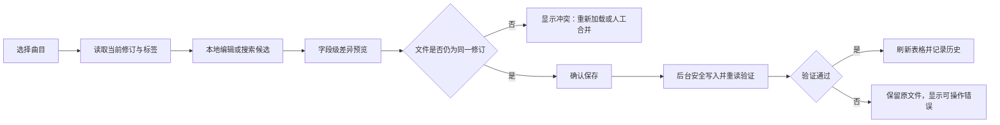

# 产品与前端交互设计

## 1. 设计目标

前端不是一个音乐播放器，而是一个“音乐资料工作台”。它需要同时满足：

- 新用户不用理解 ID3 帧名，也能完成查看、搜索、补全和保存。
- 熟练用户能高密度浏览大量字段、批量操作并查看原始标签。
- 任何会改动文件的操作都能在执行前说明“改哪些文件、改哪些字段、为什么”。
- 外部数据源失败、匹配不确定、文件被其他程序修改时，不把用户留在模糊状态。
- 桌面端适合整理大曲库，移动端也能完成单曲查看和轻量编辑。

## 2. 信息架构

### 2.1 一级页面

| 页面 | 路径建议 | 作用 |
|---|---|---|
| 首次设置 | `/setup` | 创建管理员、添加音乐目录、检查权限、选择数据源 |
| 曲库工作台 | `/library` | 浏览文件夹、查看曲目、编辑标签、发起抓取 |
| 批量审核 | `/review/:jobId` | 审核批量匹配结果和字段差异 |
| 任务中心 | `/jobs` | 查看扫描、批量抓取、批量写入任务 |
| 修改历史 | `/history` | 按文件、时间和任务查找变更并恢复标签 |
| 数据源设置 | `/settings/providers` | 启用、配置和测试数据源 |
| 曲库设置 | `/settings/libraries` | 管理根目录、忽略规则、扫描和只读状态 |
| 系统设置 | `/settings/system` | 监听地址、认证、备份、日志和诊断 |

### 2.2 全局框架

- 顶部栏：产品名、当前曲库、全局搜索、任务状态、主题、用户菜单。
- 主导航：曲库、任务、历史、设置。
- 全局任务抽屉：右下角/右侧常驻入口，显示进行中、等待、失败数。
- 全局播放器条：可选的轻量试听条，只播放本地文件，不扩展成完整播放产品。

## 3. 曲库工作台

桌面端采用可收缩三栏布局，吸收 music-tag-web 的高效工作台思路，但把“候选结果”改为按需打开的抽屉，给曲目表和编辑器更多空间。

```text
┌──────────────────────────────────────────────────────────────────────────────┐
│ 曲库 A  [全局搜索……]                    扫描中 37%   任务(2)   设置          │
├───────────────┬──────────────────────────────────┬───────────────────────────┤
│ 文件夹/筛选   │ 曲目表                           │ 检查器                    │
│               │ □ 封面 文件名 标题 艺术家……     │ [标签][封面][歌词][技术]  │
│ ▾ Music       │ □ ...                            │ 标题                       │
│   ▾ Artist    │ □ ...                            │ 艺术家                     │
│     Album     │ □ ...                            │ 专辑 / 专辑艺术家          │
│               │                                  │ 音轨 / 光盘                │
│ [无标题] 12   │                                  │                           │
│ [无封面] 31   │                                  │ [查看原始标签]             │
├───────────────┴──────────────────────────────────┴───────────────────────────┤
│ 已选择 12 首  [批量编辑] [抓取元数据] [导出预览]                [取消选择] │
└──────────────────────────────────────────────────────────────────────────────┘
```

### 3.1 左栏：目录与智能筛选

- 显示已配置曲库和相对目录，不暴露服务器绝对路径给普通页面。
- 目录按需展开，显示直接子目录和音乐文件统计。
- 支持面包屑、返回、刷新当前目录。
- 智能筛选：无标题、无艺术家、无专辑、无封面、无歌词、解析失败、最近修改。
- 显示曲库是否可写、上次扫描时间和扫描状态。
- 不提供任意路径输入框；目录只能来自管理员已配置的 Library Root。

### 3.2 中栏：曲目表

默认列：

- 选择框、状态、封面、文件名、标题、艺术家、专辑、音轨、光盘、年份、格式、时长。

可选列：

- 专辑艺术家、风格、歌词状态、码率、采样率、位深、声道、大小、更新时间、来源 ID。

交互要求：

- 使用虚拟列表，10 万条记录也不能一次渲染全部 DOM。
- 列可显示/隐藏、排序、调整宽度；配置保存在浏览器本地。
- 单击选中并打开检查器；双击或 Enter 进入首个可编辑字段。
- Space 播放/暂停，方向键切换曲目，`Cmd/Ctrl+S` 保存当前草稿。
- 多选后底部出现批量操作条；单选时不占空间。
- 文件发生外部变化时显示“已过期”状态，保存前要求重新加载或合并。
- 解析失败的文件仍显示在表中，并提供错误详情和重新解析。

### 3.3 右栏：曲目检查器

#### 标签页一：标签

常用字段分组：

- 基本：标题、艺术家（多值）、专辑、专辑艺术家（多值）。
- 序号：音轨号/总音轨、光盘号/总光盘。
- 发行：发行日期、原始发行日期、风格（多值）、语言。
- 署名：作曲、作词、指挥、混音、厂牌。
- 标识：ISRC、MusicBrainz Recording/Release/Artist ID。
- 其他：评论、分组、BPM、版权。

字段必须区分：

- 空值：当前没有标签。
- 多值：以 chip/list 编辑，不用逗号字符串冒充数组。
- 不支持写入：当前格式或引擎不能可靠写该字段。
- 混合值：批量编辑时所选文件值不同。

编辑后顶部出现“未保存”标志，底部提供：

- 放弃。
- 查看差异。
- 保存。
- 从数据源查找。

#### 标签页二：封面

- 展示所有内嵌图片，而不仅是第一张。
- 显示图片类型、MIME、尺寸、文件大小和描述。
- 支持上传、粘贴、删除、设为 Front Cover。
- 抓取到的远程封面先显示来源和许可提示，再允许选定。
- 上传限制在后端执行，前端同步展示：支持类型、最大字节、最大像素。

#### 标签页三：歌词

- 区分纯文本、同步 LRC、翻译歌词。
- 提供纯文本与时间轴源码切换。
- 允许“写入标签”“保存同名 .lrc sidecar”分别选择。
- 对 MVP 不支持的原生 SYLT 写入显示明确提示，不能假装已写入。

#### 标签页四：技术属性

只读展示：

- 容器、内部编码、时长、码率、采样率、位深、声道。
- 文件大小、修改时间、相对路径、解析器版本。
- 当前修订 ID、最近写入时间、文件权限。

#### 标签页五：原始标签与历史

- 原始标签以 key → values 形式只读展示。
- 默认保留未知标签；高级模式可删除明确选中的原始键。
- 历史显示每次修改的来源、任务、操作者、差异和结果。
- 恢复动作也走差异预览和安全写入。

## 4. 单曲编辑流程



差异预览按字段显示：

| 字段 | 当前值 | 新值 | 来源 | 动作 |
|---|---|---|---|---|
| 标题 | `Track 01` | `晴天` | 网易云 | 覆盖 |
| 艺术家 | `周杰伦` | `周杰伦` | 网易云 | 不变 |
| 专辑 | 空 | `叶惠美` | MusicBrainz | 填充 |
| 评论 | `rip 2024` | 空 | 候选无值 | 保留 |

候选项缺少某字段时，默认是“保持原值”，绝不是“清空”。

## 5. 抓取候选交互

### 5.1 搜索抽屉

打开后由本地标签和文件名预填：

- 标题、艺术家、专辑。
- 可选 ISRC、MusicBrainz ID、时长。
- 数据源多选；默认只选择已启用且健康的来源。

结果卡显示：

- 标题、艺术家、专辑、封面、发行日期、时长、音轨/光盘。
- 来源、来源 ID、匹配分数、匹配原因。
- “版本差异”提示，例如 Live、Remaster、Instrumental、伴奏。
- 哪些能力可用：歌词、高清封面、专辑详情。

### 5.2 选择候选

选择后进入字段 diff：

- 每个字段单独勾选。
- 支持“只填空值”“采用所选字段”“全部采用但保留本地评论”模板。
- 多值字段可选择替换、合并或保持。
- 封面和歌词需要单独选择具体版本。
- 显示来源归属，不把多个来源融合后的字段伪装成单一来源。

### 5.3 无结果和失败

- 无结果：建议修改关键词、切换来源或使用手工编辑。
- 单源失败：结果区域显示该源失败，但保留其他来源结果。
- 全部失败：展示重试时间、错误类别和设置入口。
- 限流：显示“等待数据源允许重试”，不连续点击制造更多请求。

## 6. 批量操作

### 6.1 批量编辑

支持：

- 设置/追加/删除风格。
- 设置专辑、专辑艺术家、年份等公共字段。
- 按序号生成音轨号。
- 文本查找替换、大小写和空白清理。

批量编辑器必须显示：

- 影响文件数。
- 每个字段的操作类型，而不仅是最终输入值。
- 不可写和已冲突文件数。
- 前 20 条差异样例，并可导出完整 JSON/CSV 预览。

### 6.2 批量抓取

分为三个阶段：

1. **分析**：生成查询并从多个来源获取候选，不写文件。
2. **审核**：按“高置信、需审核、无匹配、失败”分组。
3. **应用**：只对用户确认的 job item 写入。

批量审核页采用表格：

- 每行一个本地文件。
- 可展开候选和字段差异。
- 支持“接受所有高置信候选”，但仍需要一次总确认。
- 默认只填缺失字段；覆盖已有标签必须显式切换策略。
- 可以跳过单个文件、修改查询、改选候选。

应用阶段的失败不回滚已经成功的其他文件；结果必须逐文件可见并可重试失败项。

## 7. 任务中心

任务状态：

- `pending`：等待 worker。
- `running`：执行中。
- `waiting_retry`：等待数据源退避。
- `review_required`：分析完成，等待人工审核。
- `succeeded`：全部成功。
- `partial`：部分成功。
- `failed`：整体失败。
- `cancelled`：用户取消。

任务卡显示处理数/总数、成功/跳过/失败数、当前步骤和预计剩余时间。页面刷新或服务重启后状态不能丢失。

取消是协作式的：当前文件完成安全点后停止，不在写文件中途强杀 worker。

## 8. 首次设置

首次启动不提供 `admin/admin` 默认账号。流程：

1. 使用终端打印的一次性 setup token 进入设置。
2. 创建管理员密码。
3. 添加音乐目录，后端检查存在性、读权限和写权限。
4. 先以只读模式扫描样本并展示格式统计、错误和耗时估计。
5. 选择是否开启写入。
6. 配置数据源，逐个点击“测试连接”。
7. 进入曲库并启动完整扫描。

如果服务监听非 loopback 地址，必须完成认证设置；默认只监听 `127.0.0.1`。

## 9. 响应式设计

### 桌面 ≥ 1280px

- 三栏同时显示。
- 左栏和右栏可折叠、可调宽。
- 候选使用右侧二级抽屉或全宽审核页。

### 平板 768–1279px

- 文件夹栏为抽屉。
- 曲目表与检查器二选一或 60/40 分屏。
- 批量操作条保持在底部。

### 手机 < 768px

- 一级页面切成“目录 → 曲目列表 → 曲目详情”。
- 详情使用标签/封面/歌词/技术四个 tab。
- 候选结果使用全屏 sheet。
- 批量审核只提供筛选、接受/跳过和查看差异；复杂规则建议桌面完成。

## 10. 视觉方向

- 采用偏工具型、克制的视觉，不复制 music-tag-web 的样式。
- 中性灰背景 + 一种强调色；封面是主要彩色元素。
- 使用紧凑/舒适两种密度。
- 状态色只表达语义：成功、警告、失败、只读、未保存。
- 技术字段使用等宽数字，长文件名和标签值可复制。
- 深色模式从第一版支持，配色通过 CSS tokens 管理。

## 11. 前端技术设计

### 11.1 技术栈

沿用 Chattor 已验证的基础栈：

- React 19 + TypeScript。
- Vite。
- Tailwind CSS 4。
- Lucide React。
- `clsx` + `tailwind-merge`。
- Vitest。

针对本项目新增：

- React Router：页面与浏览历史。
- TanStack Query：API 缓存、失效和轮询/SSE 后的局部更新。
- React Hook Form + Zod：标签编辑和请求校验。
- react-virtuoso：大曲目表虚拟化；若列冻结需求超出能力，再评估 TanStack Table + Virtual。
- Testing Library + Playwright：组件与关键用户流测试。

版本在脚手架落地时统一锁定，不在设计文档中使用浮动 `latest`。

### 11.2 前端目录

```text
frontend/src/
├── app/                 # 路由、Provider、全局布局
├── components/          # 通用 UI
├── features/
│   ├── libraries/       # 曲库与目录
│   ├── tracks/          # 表格、检查器、编辑器
│   ├── matching/        # 搜索候选、评分、差异
│   ├── batch/           # 批量编辑与审核
│   ├── jobs/            # 任务中心和 SSE
│   ├── history/         # 修订历史
│   └── settings/        # 数据源、曲库和系统设置
├── lib/                 # API client、错误、格式化、SSE
├── styles/              # token 与全局样式
└── types/               # 由 OpenAPI 生成或集中定义的 DTO
```

### 11.3 状态边界

- 服务端事实：TanStack Query。
- 当前编辑草稿：React Hook Form。
- 表格选择、列布局、面板宽度：局部状态 + localStorage。
- 任务状态：以 SSE 事件更新 Query Cache，断线后用 GET 快照恢复。
- 不把曲库列表完整复制到全局 Redux store。
- 编辑器保存使用 `revision`/`If-Match`，避免旧页面覆盖新文件。

## 12. 可访问性与性能

- 所有操作可键盘完成，焦点不会因虚拟列表复用而丢失。
- 状态不能只靠颜色表达。
- 表单错误靠近字段并在顶部汇总。
- 封面包含描述性 alt；纯装饰图片用空 alt。
- 尊重 `prefers-reduced-motion`。
- 表格分页/游标读取，每次建议 100–300 条。
- 封面使用缩略图端点和懒加载，不直接加载原图。
- 搜索输入 debounce；抓取只在用户提交后执行。
- 路由按页面拆包，设置和历史不进入曲库首屏 chunk。

## 13. 前端验收基线

- 5 万条索引数据下，进入已扫描目录不冻结主线程。
- 单曲从选择到显示标签，局域网 P95 小于 300ms（不含首次封面生成）。
- 页面刷新后，进行中的任务和编辑冲突能正确恢复。
- 批量应用前始终存在可见的影响文件数和字段差异。
- 数据源部分失败时仍可使用其他来源结果。
- 手机宽度下能够完成单曲标签、封面和歌词查看/编辑。
- 自动化测试至少覆盖：首次设置、单曲编辑、冲突、候选选择、批量审核、任务断线恢复。
