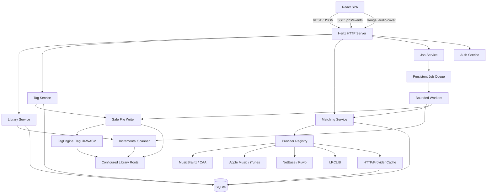

# 总体架构与后端设计

## 1. 架构目标

- 一个 Go 进程承载 API、静态前端、扫描、抓取和写入 worker。
- 生产环境默认 `CGO_ENABLED=0`，方便 Linux amd64/arm64 交叉编译。
- 核心功能不依赖 Redis、MySQL、Python、FFmpeg 或系统 TagLib。
- 大曲库扫描和批量抓取不会阻塞 HTTP 请求。
- 外部数据源、标签引擎、数据库和文件系统通过接口隔离。
- 单个损坏文件或单个数据源失败不会终止整批任务。
- 所有写文件路径都有明确边界、并发控制、冲突检测和写后验证。

## 2. 总体架构



## 3. 后端模块

### 3.1 `internal/server`

职责：

- Hertz 路由、中间件、认证、CSRF/Origin 检查。
- JSON DTO 解析与响应，不包含业务规则。
- 静态前端、SPA fallback、缩略图和音频 Range 响应。
- SSE 任务事件。
- 请求 ID、访问日志、错误映射和 panic recovery。

选择 Hertz 的原因不是极端性能，而是本地 Chattor 已有可复用的启动、路由和嵌入静态资源经验。业务层接口不依赖 Hertz 类型，未来替换 Web 框架不会影响核心。

### 3.2 `internal/library`

职责：

- 曲库根目录配置与权限探测。
- 文件/目录列表、分页、排序和筛选。
- 文件 ID 与受控路径解析。
- 扫描编排、索引更新、缺失文件处理。
- 封面缩略图定位。

重要约束：HTTP 层只能把 `file_id` 或 `library_id + relative_path` 交给本模块；本模块才有权转换成绝对路径。

### 3.3 `internal/scanner`

借鉴 Navidrome 的分阶段处理，但针对编辑器简化：

1. **Discover**：遍历目录，识别音频文件、sidecar 歌词和本地图片。
2. **Diff**：与 SQLite 中的 size、mtime、文件标识比较，找出新增、变化和缺失。
3. **Extract**：并发读取变更文件的标签与技术属性。
4. **Persist**：单 writer/短事务批量更新索引和解析错误。
5. **Reconcile**：保守识别移动、标记缺失、更新目录统计。


实现原则：

- `filepath.WalkDir` 或基于 `fs.FS` 的 walker。
- 扩展名做快速过滤，文件头/TagEngine 负责最终识别。
- 忽略 dot folder、系统目录和用户 glob；支持类似 `.taggerignore`。
- 默认不跟随符号链接。
- 每个文件独立错误；目录不可读记录 warning 后继续。
- 解析并发默认 `min(runtime.NumCPU(), 8)`，可配置。
- 持久化批次建议 100–200 条。
- 同一曲库不并发扫描；多个曲库可以在资源允许时并发。
- 全量扫描可中断，服务重启后重新运行；索引更新按短事务提交，不维持超长事务。

### 3.4 文件监听

`fsnotify` 只作为低延迟提示：

- 监听目录而不是单文件。
- 对 create/write/rename/remove 做 2–5 秒 debounce。
- 合并为受影响的最小目录集合，再创建 selective scan job。
- 事件洪泛时退化为整个曲库 quick scan。
- NFS/SMB/FUSE 默认建议定时 quick scan，因为通知可能不可靠。
- 无论是否启用 watcher，启动扫描、手动扫描和周期对账都存在。

### 3.5 `internal/tags`

核心接口：

```go
type Engine interface {
    Probe(ctx context.Context, path string) (AudioProperties, error)
    Read(ctx context.Context, path string) (Snapshot, error)
    Write(ctx context.Context, path string, patch Patch) error
    ReadPictures(ctx context.Context, path string) ([]Picture, error)
    WritePictures(ctx context.Context, path string, changes []PictureChange) error
    Version() string
}
```

首个实现 `internal/tags/taglibwasm` 适配 `go.senan.xyz/taglib`。业务层不接触 TagLib 常量；格式映射集中在适配器和规范化层。

### 3.6 `internal/filewrite`

它是文件安全边界，而不是 TagEngine 的薄封装：

- 根目录 containment 与符号链接检查。
- 每文件互斥锁。
- 乐观并发修订检查。
- 创建同目录临时副本。
- 在副本上执行标签、封面和 sidecar 变更。
- 重读副本并验证。
- fsync + 原子替换。
- 记录历史、清理临时文件。
- 故障注入点和启动时残留恢复。

详细流程见[音频元数据模型与安全写入](./03-音频元数据模型与安全写入.md)。

### 3.7 `internal/providers`

- provider 注册表。
- 能力型接口：TrackSearch、AlbumLookup、Lyrics、Artwork、Fingerprint。
- 公共 HTTP client、限流、重试、缓存、响应大小限制。
- 统一候选模型、去重、评分和字段来源。
- provider 健康状态与配置校验。

详细设计见[音乐数据抓取器设计](./04-音乐数据抓取器设计.md)。

### 3.8 `internal/jobs`

使用 SQLite 持久化任务，不引入消息队列服务。

任务组成：

- `jobs`：任务整体、配置、状态、进度和 lease。
- `job_items`：每个文件/查询的独立状态、候选、选择和错误。
- worker pool：扫描、网络抓取和文件写入使用不同并发额度。
- event hub：内存中发布进度；SSE 断线后从 DB 快照续接。

worker claim 语义：

1. 在短事务中选择 `pending` 或已过期的 `running` 任务。
2. 写入 worker ID、`lease_until`、attempt 并切换为 running。
3. 每隔固定时间 heartbeat 延长 lease。
4. 每个 item 完成后持久化进度。
5. 崩溃后 lease 到期，允许另一 worker 恢复。
6. 达到重试上限后进入 failed；网络 429 使用 provider 给出的 Retry-After。

写入任务的 item 必须幂等：保存目标 revision 和 patch；若重试时文件已是期望值，直接标记成功；若 revision 发生未知变化，标记 conflict，不盲目重放。

### 3.9 `internal/store`

- `database/sql` + `modernc.org/sqlite`。
- WAL 模式、busy timeout、foreign keys。
- 连接池按 SQLite 特性控制，写路径保持短事务。
- SQL migration 使用 `pressly/goose/v3` 并通过 `go:embed` 嵌入。
- repository 返回领域对象，不让 SQL row 泄漏到 HTTP。

不在第一版引入 ORM。查询数量有限且需要精确控制 JSON、多值字段和任务 claim，手写 SQL 更透明。

### 3.10 `internal/auth`（当前简化实现）

本项目是单用户本地工作台，不引入管理员账号、密码或多用户 session。部署时可通过 `--auth-token` / `TAGGER_AUTH_TOKEN` 设置一个实例级访问令牌：

- 令牌为空时不启用鉴权，适合只绑定本机的默认运行方式。
- 设置令牌后，`/api/v1/*` 使用 `Authorization: Bearer <token>`（兼容 `X-Tagger-Token`）保护；`/healthz`、`/readyz` 和静态资源保持公开。
- 前端检测到 401 后显示令牌输入页，并将令牌保存在当前浏览器的本地存储中，仅随 API 请求发送；后端在令牌请求成功后下发 HttpOnly、SameSite cookie，供原生图片、音频和 SSE 请求携带。

未来如果需要多用户，再在领域层加入角色、session 和 library ACL；当前不把复杂权限散布到每个 repository。

## 4. 路径与文件系统安全

### 4.1 路径解析规则

```go
type FileRef struct {
    LibraryID string
    FileID    string
}
```

处理步骤：

1. 从 DB 读取 library root 和文件相对路径。
2. 拒绝空字节、绝对路径、`..`、Windows volume/UNC 绕过。
3. `filepath.Clean` 后拼接。
4. 根据 library 策略执行 `filepath.EvalSymlinks`。
5. 用 `filepath.Rel` 验证最终目标仍在根目录内。
6. 打开文件后尽可能再次验证文件身份，减少 TOCTOU。

默认：

- 不跟随 symlink。
- 不把 symlink 指向根目录外的音乐纳入曲库。
- 隐藏目录、回收站、macOS 元数据目录忽略。
- 文件写权限单独记录；可读不等于可写。

### 4.2 进程实例

- 数据目录使用进程锁，防止两个 Tagger 实例共用同一 SQLite。
- 曲库根目录不主动写锁文件，避免污染音乐目录。
- 文档明确不支持两个 Tagger 实例同时写同一曲库。
- 外部标签编辑器无法被强制锁住，因此依靠 revision 冲突检测。

## 5. HTTP 与媒体服务

### 5.1 API

- 前缀 `/api/v1`。
- JSON body 限制，默认 1MiB；封面上传使用独立上限。
- 游标分页，不允许无限 limit。
- 错误结构有稳定 code、message、details、request_id。
- OpenAPI 作为前后端契约和类型生成来源。

### 5.2 音频试听

- `GET /api/v1/files/:id/audio` 支持 Range、HEAD、ETag 和 If-Range。
- 只允许已索引的音频文件。
- 正确设置 MIME、Content-Length、Accept-Ranges。
- 不转码；浏览器不支持的编码直接提示。
- 试听请求不占用标签 worker。

### 5.3 封面

- 原图端点需要认证和文件 ID。
- 缩略图按内容 hash 缓存，尺寸限制为预设枚举，避免任意尺寸导致资源耗尽。
- 解码前限制响应字节，解码后限制总像素。
- 默认只支持 JPEG/PNG/WebP 输入；写回前可统一转换为 JPEG/PNG 的兼容配置。

### 5.4 前端静态资源

- 生产环境从嵌入 FS 服务。
- hashed asset 使用长期 immutable cache。
- `index.html` 不缓存。
- SPA fallback 只处理 GET 且 Accept 包含 HTML；`/api`、`/healthz`、`/assets` 绝不 fallback。
- 开发环境通过 Vite proxy 或完整 reverse proxy，而不是用简单 `http.Get` 丢失 method/query/header。

## 6. 并发与资源预算

默认并发建议：

| 工作 | 默认 |
|---|---:|
| 标签读取 | min(CPU, 8) |
| 同时扫描的曲库 | 1 |
| provider 网络请求 | 每源 2，总计 8 |
| 文件写入 | 2 |
| 同一路径写入 | 1 |
| 封面解码 | 2 |
| 指纹计算 | 1（未来） |

所有并发可配置但有安全上限。批量写入刻意低并发，NAS 上的随机 I/O 和安全性比吞吐量重要。

内存控制：

- 扫描使用流式 producer/consumer，不把全曲库路径一次载入内存。
- 封面读取有字节上限。
- HTTP 响应有大小上限。
- 候选缓存保存规范化 JSON，不长期保存大图二进制。
- 标签引擎调用设置 context deadline；若底层无法中断，worker 至少不再接新任务并记录超时。

## 7. 配置

优先级：CLI flags > 环境变量 > SQLite settings > 默认值。

建议：

- `--listen 127.0.0.1:8080`
- `--data-dir /path/to/data`
- `--dev`
- `TAGGER_LOG_LEVEL`
- `TAGGER_SESSION_SECRET`
- `TAGGER_APPLE_TEAM_ID` / `TAGGER_APPLE_KEY_ID` / 私钥文件路径

音乐根目录和一般 provider 配置由 UI 保存到 SQLite。敏感值：

- 优先由环境变量/文件引用提供。
- 如需 UI 保存，使用实例 master key 加密后存储，数据库和 key 不应放在同一备份里。
- 日志和 API 响应永不返回完整 cookie、token 或私钥。

## 8. 可观测性

- 使用标准库 `log/slog` 结构化日志。
- 字段：request_id、job_id、job_item_id、library_id、file_id、provider、duration。
- 路径默认记录为 library + relative path，不记录 provider secret。
- `/healthz`：进程存活。
- `/readyz`：SQLite、迁移、数据目录、worker 是否就绪。
- `/api/v1/system/diagnostics`：版本、TagEngine 版本、支持格式、目录权限、worker 状态，不包含秘密。
- 任务错误保留用户可理解的 code 和截断后的技术详情。

第一版不强制 Prometheus；预留 metrics 接口，后续可加入扫描数、provider 延时、写入失败、队列深度。

## 9. 主要 Go 依赖

| 依赖 | 用途 | 备注 |
|---|---|---|
| `github.com/cloudwego/hertz` | HTTP server | 与 Chattor 一致 |
| `go.senan.xyz/taglib` | 标签/封面/属性读写 | TagLib 2.1.1 WASM；固定版本 |
| `modernc.org/sqlite` | SQLite driver | CGO-free |
| `github.com/pressly/goose/v3` | DB migration | migration 嵌入二进制 |
| `github.com/fsnotify/fsnotify` | 本地 FS 变更提示 | NAS 上必须有 polling fallback |
| `golang.org/x/time/rate` | provider 限流 | 每 provider 单独 limiter |
| `golang.org/x/crypto/argon2` | 密码哈希 | 参数写入密码记录 |
| `github.com/oklog/ulid/v2` 或 UUID | ID | 最终只选一种 |
| `github.com/gofrs/flock` | 数据目录进程锁 | 跨平台 |
| `golang.org/x/text` | Unicode 归一化 | 匹配，不修改展示原文 |

除非标准库不能清晰完成，不再为 retry、HTTP 或 JSON 叠加大型框架。HTTP 重试应是项目内一个小型、可测试的 policy，明确只重试幂等请求、429 和有限的 5xx。

## 10. 不采用的架构

### 微服务

数据源、扫描器和写入器没有独立部署价值。拆分只会增加队列、认证和运维成本。

### Redis/Celery 式外部队列

违背单二进制启动目标。SQLite lease queue 足以支撑单实例的 NAS 工具。

### Go `plugin`

跨平台支持和版本兼容较弱，会破坏分发体验。MVP provider 是编译期注册；若以后需要第三方扩展，优先设计受限 WASM 或 stdio 子进程协议。

### 直接用 FFmpeg 写标签

FFmpeg 很适合转码和验证，但对不同容器的标签/封面语义以及“保留未知帧”不如专门标签库直观。它只作为可选诊断与测试工具。

### 只读目录时复制到数据目录编辑

用户期待修改原音乐文件。只读曲库应明确展示只读并禁用保存，不偷偷创建另一份副本。

## 11. 后端验收基线

- `CGO_ENABLED=0` 可以构建 Linux amd64/arm64。
- 不安装 TagLib/FFmpeg/Node 时，生产二进制仍能启动并读写认证格式；Node 只在构建前端时需要。
- 服务重启后，running job 能被恢复或明确转为待恢复状态。
- 同一文件并发保存只有一个成功，另一个收到 revision conflict。
- 任意 `../`、绝对路径、编码变体和 symlink 逃逸都不能读写根目录外文件。
- 单个损坏音频不会终止扫描。
- NFS watcher 不工作时，手动/定时 quick scan 仍能发现变化。
- provider 429 能尊重 Retry-After，且不会拖住其他 provider。
- 写入失败后原文件仍可读取，且任务结果包含精确失败阶段。
