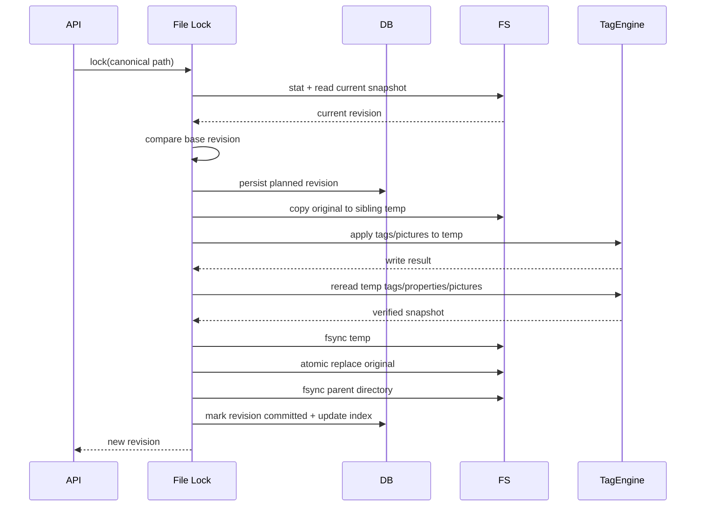

# 音频元数据模型与安全写入

## 1. 为什么需要自己的统一模型

MP3 的 ID3v2、FLAC 的 Vorbis Comment、WAV 的 RIFF INFO/ID3 chunk 并不是同一套数据结构。如果 UI 和业务逻辑直接使用 `TIT2`、`TPE1`、`APIC` 等格式字段，会出现：

- 每增加一种格式都要修改页面和抓取器。
- 多值艺术家在不同格式下被错误拼成字符串。
- track/disc 的当前值和总数被混为一个字段。
- 写入通用字段时意外删除未知或格式专有标签。
- WAV 等格式在本应用内“写成功”，但目标播放器不可见。

因此需要三层：

1. **RawSnapshot**：TagEngine 读到的原始统一键和值数组，用于保真、诊断和历史。
2. **NormalizedTags**：产品可理解的强类型字段。
3. **FormatAdapter**：统一键与实际容器字段之间的映射，由 TagLib 和适配器承担。

## 2. 领域模型

### 2.1 统一标签

```go
type NormalizedTags struct {
    Title           string
    Subtitle        string
    Artists         []Credit
    Album           string
    AlbumArtists    []Credit
    Genres          []string

    Track           IndexValue
    Disc            IndexValue
    RecordingDate   PartialDate
    ReleaseDate     PartialDate
    OriginalDate    PartialDate

    Composers       []Credit
    Lyricists       []Credit
    Conductors      []Credit
    Remixers        []Credit
    Label           string
    CatalogNumber   string
    ISRCs           []string
    Language        string
    BPM             *float64
    Comment         string
    Grouping        string
    Copyright       string

    Lyrics          []LyricsValue
    ExternalIDs     map[string][]string
    Extra           map[string][]string
}

type IndexValue struct {
    Number *int
    Total  *int
}

type PartialDate struct {
    Raw   string
    Year  *int
    Month *int
    Day   *int
}

type Credit struct {
    Name string
    Role string
    ID   string
}
```

设计细节：

- 艺术家和风格从一开始就是数组。
- `Artist` 与 `AlbumArtist` 永不互相代替。
- 日期保存原始字符串和可解析分量；`2020`、`2020-05`、`2020-05-01` 都是合法值。
- track/disc 的 number 与 total 分开，避免 `1/12` 在不同格式间反复解析。
- `Extra` 保留未建模的标签，不在普通编辑时删除。
- 外部 ID 的 key 采用明确命名，如 `musicbrainz_recording`、`apple_song`、`netease_song`。

### 2.2 技术属性

```go
type AudioProperties struct {
    Container    string
    Codec        string
    DurationMS   int64
    BitRateKbps  int
    SampleRateHz int
    BitDepth     int
    Channels     int
}
```

技术属性只读，不允许通过标签编辑 API 修改。转码属于未来独立模块。

### 2.3 图片

```go
type Picture struct {
    Index       int
    Kind        string
    Description string
    MIMEType    string
    Width       int
    Height      int
    SizeBytes   int64
    ContentHash string
}
```

图片内容按需读取。曲目列表只使用缓存缩略图，不把原始字节放进标签 JSON。

### 2.4 歌词

```go
type LyricsValue struct {
    Kind        string // plain, synced_lrc, translation
    Language    string
    Description string
    Text        string
    Source      string
}
```

MVP 规则：

- 纯文本歌词写入标准 `LYRICS` 统一键。
- 同步 LRC 首选同名 `.lrc` sidecar，用户可选择是否也把原始 LRC 文本写入 `LYRICS`。
- MP3 的标准同步歌词是 SYLT，而 go-taglib 当前通用接口没有提供 SYLT 专有写入；UI 必须标为“sidecar/兼容模式”，不能声称写了 SYLT。
- 将来若增加专用 ID3 引擎，可同时写 SYLT 与 USLT。beets 近期的实现也采用“LRC → SYLT、纯文本 → USLT”，可作为后续互操作参考。

## 3. 统一键与格式映射

应用层使用 TagLib PropertyMap 风格的统一键。下表是概念映射，最终以 [TagLib 官方 Property Mapping](https://taglib.org/api/p_propertymapping.html) 和测试结果为准：

| 产品字段 | 统一键 | MP3/ID3v2 常见帧 | FLAC/Vorbis | WAV/RIFF 常见字段 |
|---|---|---|---|---|
| 标题 | `TITLE` | TIT2 | TITLE | INAM |
| 艺术家 | `ARTIST` | TPE1 | ARTIST | IART |
| 专辑 | `ALBUM` | TALB | ALBUM | IPRD |
| 专辑艺术家 | `ALBUMARTIST` | TPE2 | ALBUMARTIST | 无稳定基础 RIFF 映射 |
| 音轨号 | `TRACKNUMBER` | TRCK | TRACKNUMBER | ITRK |
| 光盘号 | `DISCNUMBER` | TPOS | DISCNUMBER | 无稳定基础映射 |
| 录音/日期 | `DATE` | TDRC | DATE | ICRD |
| 原始发行日期 | `ORIGINALDATE` | TDOR/TXXX | ORIGINALDATE | 无稳定基础映射 |
| 风格 | `GENRE` | TCON | GENRE | IGNR |
| 评论 | `COMMENT` | COMM | COMMENT | ICMT |
| 歌词 | `LYRICS` | USLT | LYRICS/UNSYNCEDLYRICS | 通常依赖 ID3 chunk |
| 封面 | complex picture | APIC | PICTURE block | 通常依赖 ID3 chunk |
| ISRC | `ISRC` | TSRC | ISRC | 无稳定基础映射 |
| MusicBrainz ID | `MUSICBRAINZ_*` | TXXX | 同名键 | 通常依赖 ID3/扩展 |

不要在业务代码中自行拼接帧。适配器负责：

- 将多个 alias 归一化。
- 处理大小写。
- 把空列表解释为删除指定键。
- 不使用 `Clear` 全清模式，除非用户执行明确的“清理所有标签”高级动作。
- 写后再次读取并比较归一化值，而不是比较底层字节布局。

## 4. 格式兼容策略

### 4.1 产品认证矩阵

| 格式 | 容器标签 | 读取 | 常用字段写入 | 多值 | 封面 | 歌词 | MVP 等级 |
|---|---|---:|---:|---:|---:|---:|---|
| MP3 | ID3v2.3/2.4，兼读 ID3v1 | 是 | 是 | 需互操作测试 | 是 | USLT | A |
| FLAC | Vorbis Comment + PICTURE | 是 | 是 | 原生 | 是 | 文本键 | A |
| WAV | RIFF INFO 和/或 ID3 chunk | 是 | 是 | 有限制 | 有限制 | 有限制 | B |
| M4A/MP4 | iTunes atoms | 引擎支持 | 后续认证 | 有限制 | 支持 | 支持度需测 | Roadmap |
| OGG/Opus | Vorbis Comment | 引擎支持 | 后续认证 | 原生 | convention | 文本键 | Roadmap |
| APE/WV/AIFF/WMA/DSF | 各自容器 | 引擎支持 | 后续认证 | 待测 | 待测 | 待测 | Roadmap |

等级说明：

- A：默认开放读写。
- B：默认开放常用字段，但 UI 显示兼容性提示；提供只读/备份策略。
- Roadmap：扫描可先标为 experimental，未通过测试前不开放写入。

WAV 不承诺所有播放器看到所有字段。测试报告应明确：本应用、Navidrome、Jellyfin、foobar2000/其他目标播放器分别能否读取。

### 4.2 ID3 版本

- 读取兼容 v2.2/v2.3/v2.4 和 ID3v1。
- 写入版本由 TagLib 行为和兼容性测试确定，不能仅按“版本更新”默认选 v2.4。
- 设置中可以预留 `mp3_write_version`，但 MVP 只提供一个经过验证的默认值。
- 旧标签编码、重复帧和多个封面必须进入测试集。

### 4.3 多值字段

- 内部始终存数组。
- 如果格式原生支持多值，按多个值写入。
- 如果某目标格式/播放器只识别分隔字符串，兼容策略属于输出 profile，不改变内部模型。
- 不默认用逗号切分艺术家；`AC/DC`、`Earth, Wind & Fire` 和中文组合名都会误伤。
- 只有输入来自明确结构化数组或用户选择了拆分规则时才拆分。

## 5. Patch 语义

写入 API 不能只提交“最终对象”，否则无法区分保持、设置和删除。

```go
type Operation string

const (
    Keep   Operation = "keep"
    Set    Operation = "set"
    Delete Operation = "delete"
    Merge  Operation = "merge"
)

type FieldPatch[T any] struct {
    Op    Operation
    Value T
}
```

规则：

- 候选项没有字段 → Keep。
- 用户清空输入后保存 → 前端必须询问是 Delete 还是恢复原值。
- 批量“只填缺失” → 当前非空时 Keep。
- 多值 Merge 去重但保持稳定顺序。
- 删除图片和删除歌词使用明确操作，不使用 null 的隐式含义。

## 6. 修订与冲突

每次读取返回：

```json
{
  "revision": "rev_01...",
  "file": {
    "size": 39124567,
    "mtime_ns": 1787191000000000000
  },
  "tag_hash": "..."
}
```

修订至少包含：

- 数据库 file ID。
- size、mtime nanoseconds。
- 规范化 raw tag map 的稳定 hash。
- 第一张及全部图片描述/hash。

保存时客户端通过 `If-Match` 或 body `base_revision` 提交。后端在取得文件锁后重新读取：

- 一致：继续写入。
- 不一致但期望 patch 已经生效：幂等成功。
- 不一致且存在额外变化：返回 `409 revision_conflict`，附当前快照摘要。

不能只比较 mtime；某些 NAS 时间精度低，外部工具也可能保留 mtime。

## 7. 安全写入流程

### 7.1 主流程



### 7.2 临时文件

- 必须创建在原文件同目录，确保 rename 不跨文件系统。
- 保留真实音频扩展名，便于 TagLib 正确识别。
- 文件名使用隐藏、不可猜的随机 ID，例如 `.song.tagger-<id>.tmp.flac`。
- 创建时使用排他标志和原文件 mode。
- 不跟随现有同名 symlink。
- 启动时扫描并处理本应用格式的残留临时文件；默认先隔离到 data recovery，而不是直接删除未知文件。

### 7.3 原子替换

Linux/Unix 主目标：

- 副本写完后 fsync。
- `os.Rename(temp, target)` 在同一文件系统完成替换。
- fsync parent directory，降低断电后目录项丢失风险。

Windows：

- 替换已存在目标的语义不同，需要平台适配器。
- 若无法原子覆盖，使用 original → recovery、temp → original 的两阶段方案，并保证启动恢复。
- Windows 写支持进入正式发布前需要故障注入测试，不能假定 Unix 代码等价。

### 7.4 校验

必须验证：

- 文件仍可被 TagEngine 打开。
- 所有 Set/Delete/Merge 操作的归一化结果符合预期。
- 未修改字段和未知标签仍存在。
- 图片数量、目标图片 hash/MIME 符合预期。
- 容器、时长、采样率、声道与写前一致；允许码率读取的微小显示差异，不允许音频流消失。
- sidecar 内容和文件名符合预期。

测试环境额外使用独立工具做互操作验证；可选 FFmpeg decode/framemd5 对比写前写后音频内容。

## 8. 历史与恢复

历史是“标签级修订”，不是复制整首音频：

- 保存写前和写后的 raw tag map。
- 保存 normalized diff。
- 保存图片描述与内容 hash；实际图片 blob 按 hash 去重存到数据目录。
- 保存 sidecar 歌词的写前/写后内容或 blob hash。
- 保存 file ID、相对路径、任务/操作者、provider provenance、时间和结果。

保留策略建议：

- 元数据修订默认保留 90 天或每文件最近 20 次。
- 图片 blob 内容寻址并在无引用后 GC。
- 不默认保存完整音频备份；设置中允许启用“写前完整备份”并配置容量/保留数。
- 无完整备份时仍能恢复已记录的标签和封面，但不能保证恢复未被 TagEngine 表达的格式私有二进制帧。

在第一次写入曲库前，UI 应提醒用户仍需有真正的文件系统备份。

## 9. Sidecar 文件

首版只正式管理：

- 与音频同 basename 的 `.lrc`。
- 当前目录的常见封面文件仅用于“导入候选”，不自动改名/覆盖。

Sidecar 也必须走：

- 根目录 containment。
- revision。
- 临时文件 + rename。
- 历史记录。

批量写入音频和 sidecar 不是跨文件系统事务。顺序建议：

1. 准备并验证所有临时文件。
2. 写音频。
3. 写 sidecar。
4. 任一步失败时尽力用 recovery 快照恢复；历史记录 partial 状态。

## 10. 图片安全

- 上传/远程下载默认上限 10MiB，可配置但有硬上限。
- 解码后像素默认上限 40MP，防止 decompression bomb。
- 只接受实际解码成功的 JPEG/PNG/WebP；不只相信扩展名或 Content-Type。
- 去除不需要的 EXIF/profile 可作为可选规范化，默认不偷偷改变用户图片。
- 远程 URL 只能由 provider adapter 产生，或经过 SSRF 防护：
  - HTTPS 优先。
  - DNS 解析后拒绝 loopback、link-local、private、metadata IP。
  - 每次 redirect 重新校验。
  - 限制 redirect 次数、响应体和总时间。
- 缩略图生成在独立有界 worker 中进行。

## 11. 测试语料

### MP3

- 无标签、只有 ID3v1、v2.3、v2.4、v1+v2 冲突。
- UTF-8/UTF-16、中文/日文/emoji。
- 多艺术家、多风格、重复 frame。
- 0/1/多张 APIC，不同 picture type。
- 大歌词、大封面、未知 TXXX/PRIV/UFID。

### FLAC

- Vorbis 多值、大小写 alias。
- 多 PICTURE、无 padding、足够 padding。
- CUESHEET/SEEKTABLE/未知 metadata block，写后应保留。
- 24-bit、不同采样率、大文件。

### WAV

- 只有 RIFF INFO。
- 只有 ID3 chunk。
- 两者同时存在且字段冲突。
- PCM 与常见非 PCM 编码。
- 大于 4GiB/RF64 作为明确支持或明确拒绝用例。

### 通用

- 截断、伪扩展名、零字节、只读、文件被占用。
- 非 ASCII 路径、超长路径、大小写冲突。
- symlink 指向根目录内/外。
- 保存前被外部程序修改。
- 写入各故障点进程退出、磁盘满、rename 失败。

每个认证格式都执行：

1. 本引擎读。
2. 写 patch。
3. 本引擎重读。
4. 独立工具读取。
5. 对比未改字段和音频属性。
6. 失败时验证原文件可恢复。

## 12. 已知限制应直接展示

- WAV 标签生态不统一。
- 同步歌词的跨格式写入不在 MVP 保证范围。
- TagLib PropertyMap 无法表示所有私有/复杂帧。
- 外部程序同时修改时只能检测冲突，不能协调其锁。
- 原子 rename 在网络文件系统上的持久化语义取决于服务端；必须测试目标 NAS。
- 元数据历史不是完整音频备份。

这些限制需要出现在设置页和具体失败提示中，而不只存在于开发文档。
